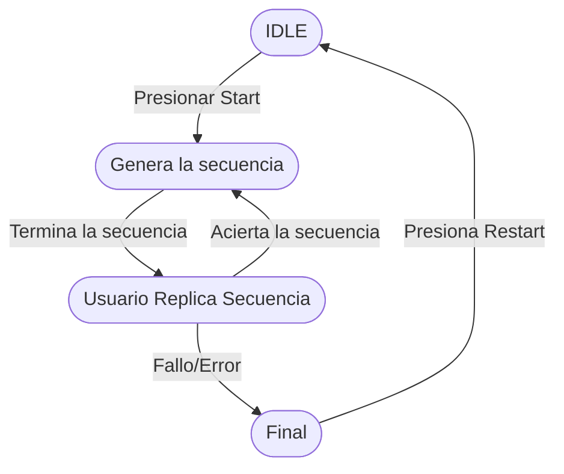

# Simón Me Dijo

**Simón Me Dijo** es un proyecto en Android con **Jetpack Compose** que implementa la lógica de un juego de memoria.

---

## Diagrama de flujo del juego

---

## Estructura del código

### 1. `Datos`

Objeto singleton que almacena los datos del juego, incluyendo la ronda actual, récord, estado del juego, secuencia de colores, color actualmente encendido y sonidos.

### 2. `Estado`

Enum que define los **cuatro estados del juego** y sus propiedades:

| Estado                | Botonera activa | Botón Start activo | Mensaje en pantalla             |
| --------------------- | --------------- | ------------------ | ------------------------------- |
| **IDLE**              | ❌               | ✅                  | "Presiona Start para comenzar"  |
| **GENERAR_SECUENCIA** | ❌               | ❌                  | "Generando secuencia"           |
| **ELECCION_USUARIO**  | ✅               | ❌                  | "Adivina la secuencia"          |
| **FINALIZADO**        | ❌               | ✅                  | "Fallaste, vuelve a intentarlo" |

### 3. `Colores`

Enum que define los colores usados en el juego con su **representación visual (`Color`)** y **texto descriptivo (`txt`)**:

* `CLASE_ROJO`, `CLASE_VERDE`, `CLASE_AZUL`, `CLASE_MORADO`

### 4. `MyVM`

ViewModel que centraliza la lógica del juego, gestionando la secuencia de colores, el estado del juego, las rondas y el récord.

### 5. UI (Jetpack Compose)

Contiene la interfaz del juego, incluyendo los botones de colores, el panel de texto, los contadores de ronda y récord, y la reproducción de sonidos según la secuencia y el estado.

---

## Flujo de estados en el código

1. **IDLE** → solo se permite presionar Start.
2. **GENERAR_SECUENCIA** → se muestran los colores de la secuencia uno a uno.
3. **ELECCION_USUARIO** → el usuario puede presionar los botones para reproducir la secuencia.
4. **FINALIZADO** → se bloquean los botones y se permite reiniciar el juego.

El flujo está controlado por `Datos.estado` y el `ViewModel` (`MyVM`), usando `MutableStateFlow` para que la UI reaccione automáticamente.
