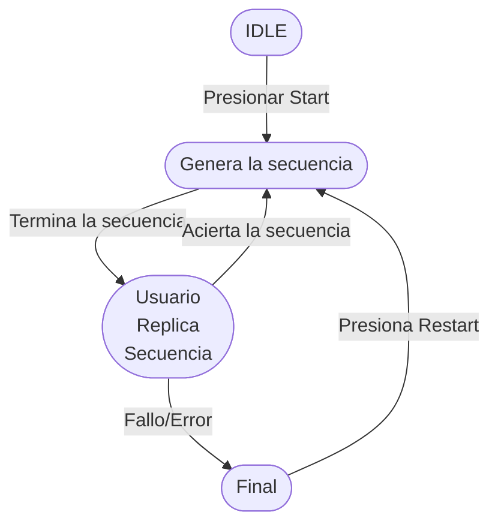

```mermaid
flowchart TD
    A(["IDLE"]) -- Presionar Start --> B(["Genera la secuencia"])
    B -- Termina la secuencia --> C(["Usuario
            Replica
            Secuencia"])
    C -- Fallo/Error --> E(["Final"])
    C -- Acierta la secuencia --> B
    E -- Presiona Restart --> B
```