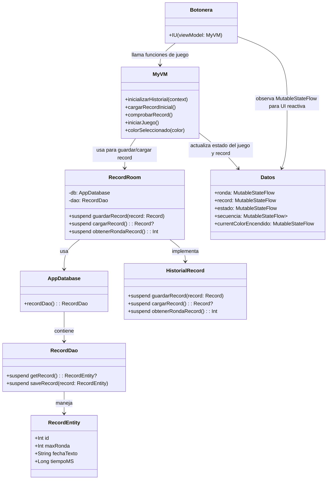

# Persistencia con Room en Simon Me Dijo

Este proyecto usa Room para guardar el récord máximo de un juego de memoria estilo Simon Says.

## Arquitectura de Room

### 1. Entidad: `RecordEntity.kt`
Representa la tabla de la base de datos:
- `id: Int` → único registro.
- `maxRonda: Int` → número máximo de rondas alcanzadas.
- `fechaTexto: String` → fecha del récord.
- `tiempoMS: Long` → timestamp.

### 2. DAO: `RecordDao.kt`
Define las operaciones sobre la tabla:
- `getRecord()`: obtiene el récord actual.
- `saveRecord(record: RecordEntity)`: guarda o reemplaza el récord.

### 3. Base de datos: `AppDatabase.kt`
- Define la base de datos Room y expone el DAO.
- `abstract fun recordDao(): RecordDao`

### 4. Interfaz: `HistorialRecord.kt`
- Permite trabajar con récords sin depender de la implementación.
- Métodos:
    - `guardarRecord(record: Record)`
    - `cargarRecord(): Record?`
    - `obtenerRondaRecord(): Int`

### 5. Implementación: `RecordRoom.kt`
- Implementa `HistorialRecord` usando Room.
- Usa `withContext(Dispatchers.IO)` para no bloquear la UI.
- Funciona con **coroutines** para operaciones asíncronas.

## Flujo
1. Al iniciar la app, se carga el récord con `cargarRecord()`.
2. Al finalizar una ronda, se comprueba si hay nuevo récord y se guarda con `guardarRecord()`.
3. La UI observa `MutableStateFlow` y actualiza el récord automáticamente.

## Beneficios
- Persistencia segura y eficiente.
- Operaciones asíncronas integradas con coroutines.
- Fácil mantenimiento y cambio de implementación gracias a la interfaz `HistorialRecord`.

classDiagram
%% ENTIDADES %%
class RecordEntity {
+Int id
+Int maxRonda
+String fechaTexto
+Long tiempoMS
}

## Diagrama de Clases (Room y Juego)

